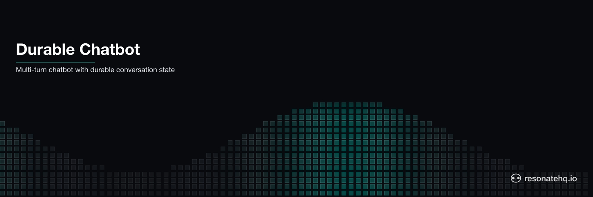

<p align="center">
  <picture>
    <source media="(prefers-color-scheme: dark)" srcset="./assets/banner-dark.png">
    <source media="(prefers-color-scheme: light)" srcset="./assets/banner-light.png">
    
  </picture>
</p>

# Durable Chatbot

A multi-turn chatbot with durable conversation state. Built with Claude (Anthropic) and Resonate.

Every LLM call is a durable checkpoint. If the API call fails mid-turn -- network timeout, rate limit, transient error -- Resonate retries it automatically. You never lose the conversation context. The user never has to re-send their message.

## What This Demonstrates

- **Durable LLM calls**: each Claude API call is wrapped in `ctx.run()` -- a durable promise checkpoint
- **Automatic retry**: LLM failures trigger automatic retries with exponential backoff -- no retry logic required
- **Conversation continuity**: on any retry or replay, the full conversation history is already captured in the workflow input
- **Idempotent turns**: each turn has a stable promise ID -- calling it twice returns the cached result, not two LLM calls

## Prerequisites

- [Bun](https://bun.sh) v1.0+
- Anthropic API key: `export ANTHROPIC_API_KEY=sk-ant-...`

No external services required. Resonate runs in embedded mode.

## Setup

```bash
git clone https://github.com/resonatehq-examples/example-durable-chatbot-ts
cd example-durable-chatbot-ts
bun install
export ANTHROPIC_API_KEY=sk-ant-...
```

## Run It

**Interactive mode** -- chat with Claude:
```bash
bun start
```

```
=== Resonate Durable Chatbot ===
Session: session-1740326400000 (type "exit" to quit)

You: What is durable execution?

[llm]   Calling Claude (attempt 1)...

Assistant: Durable execution is a programming model that ensures your code
runs to completion even if the process crashes. The runtime checkpoints your
progress so execution resumes from the last successful step, not from scratch.

You: How does Resonate implement it?

[llm]   Calling Claude (attempt 1)...

Assistant: Resonate wraps each step in a durable promise stored in its server.
If your process restarts, it replays completed promises from the store
and resumes from the last unfinished step.

You: exit

Goodbye!
```

**Crash demo** -- shows LLM retry without re-prompting:
```bash
bun start:crash
```

```
=== Resonate Durable Chatbot ===
Mode: CRASH DEMO (LLM will fail on turn 2, then retry automatically)

You: Hello! What is durable execution?

[llm]   Calling Claude (attempt 1)...

Assistant: Durable execution ensures your workflow completes even if the
process crashes mid-execution by checkpointing progress at each step.

You: How does it help with AI agents?

[llm]   Calling Claude (attempt 1)...
Runtime. Function 'callClaude' failed with 'Error: LLM API connection timeout (simulated)' (retrying in 2 secs)
[llm]   Calling Claude (attempt 2)...

Assistant: For AI agents, durable execution means LLM calls are checkpointed --
if the API call fails, it retries without losing conversation context or
re-running earlier steps in the conversation.

You: Got it. What should I try next?

[llm]   Calling Claude (attempt 1)...

Assistant: Try the multi-agent orchestration example to see how durable
execution coordinates multiple AI agents across distributed failures.

=== What Happened ===
Turn 1: LLM called once -> response cached
Turn 2: LLM call failed (connection timeout) -> Resonate retried automatically
        You did not re-send your message. Turn 1 did not re-run.
Turn 3: LLM called once -> full conversation history intact
```

**Notice**: the `Runtime. Function ... failed (retrying in N secs)` line comes from Resonate. You wrote zero retry logic.

## What to Observe

1. **No retry code in your workflow**: `processTurn` is 5 lines. There is no try/catch, no retry loop, no backoff.
2. **LLM not called twice on success**: if turn 2 had succeeded before crashing, the retry would serve the cached result.
3. **Conversation history intact on retry**: the history passed to turn 2's retry is exactly what was built up to that point.
4. **Turn 1 does not re-run**: each `resonate.run()` call with the same ID is idempotent.

## The Code

The entire workflow is 10 lines in `src/workflow.ts`:

```typescript
export function* processTurn(
  ctx: Context,
  history: ChatMessage[],
  turnKey: string,
  isCrashTurn: boolean,
) {
  // One line. Durable. Retries on failure. Cached on success.
  const response = yield* ctx.run(callClaude, history, turnKey, isCrashTurn);
  return response;
}
```

That's it. The durability is in `ctx.run`, not in your application code.

## File Structure

```
example-durable-chatbot-ts/
|-  src/
|   |-  index.ts      Entry point -- REPL loop and crash demo
|   |-  workflow.ts   processTurn generator -- one durable LLM call per turn
|   |-  llm.ts        Claude API client -- plain async function
|-  package.json
|-  tsconfig.json
```

**Lines of code**: ~130 total (including comments). The workflow itself is 10 lines.

## State lives in the generator

Conversation state — the running message history, the current turn's context, any derived signals — is a JavaScript variable inside the generator. Each LLM call is a `yield*` that checkpoints its result; on crash, the generator replays and the checkpointed turns return from the promise store without re-calling the model (and re-paying for tokens).

For the common chatbot shape — one conversation per session, long-lived, linear turn progression — this is the right trade. When you need stateful entities with concurrent-access protection (multiple callers racing to mutate the same session under a lock), layer a mutex pattern on top (see [example-distributed-mutex-ts](https://github.com/resonatehq-examples/example-distributed-mutex-ts)) or reach for an external key-value store with its own consistency model.

## Learn More

- [Resonate documentation](https://docs.resonatehq.io)
- [Distributed mutex pattern](https://github.com/resonatehq-examples/example-distributed-mutex-ts) — serialized access under contention
